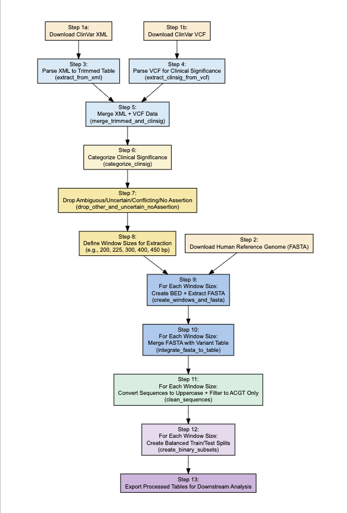

# GenoMeFI - Exploring mechanistic interpretability in genomic foundation models for genetic variant understanding
This repository benchmarks and mechanistically interprets large language models (LLMs) for predicting ClinVar variant pathogenicity. We compare three backbones—Nucleotide Transformer (NT), DNABERT-6, and GROVER—and four downstream classifiers. NT + Logistic Regression achieved the best hold-out performance and is the focus of our interpretability pipeline (attention, activation‐patching, sparse autoencoder, and circuit ablation).

## Requirements
To run these experiments you need to clone this repository and install the required librarries. 
1. **Clone the repository**  
   ```bash
   git clone https://github.com/yourusername/your-repo.git
   cd your-repo
2. 	Create a Conda environment <br>
We recommend Python 3.8 or above. Here’s an example using an environment named dna_bert2 (feel free to choose your own name):
```
conda create -n dna_bert2 python=3.8
conda activate dna_bert2
```
3.	Install core dependencies <br>
All the main Python packages are listed in requirements.txt. Once your environment is active, run:
```
pip install -r requirements.txt
```
4.	(Optional) CUDA-enabled PyTorch <br>
If you have an NVIDIA GPU and want hardware acceleration, install PyTorch with CUDA support by following the official guide:
https://pytorch.org/get-started/locally/
5.	(Optional) Jupyter Notebooks <br>
To run any of the included .ipynb notebooks, install Jupyter:
```bash
pip install jupyter
```

## 📂 Repository Layout
```
.
├── clinvar_vcf/
├── clinvar_xml_data/
├── data/
├── finetuned_models/
│   ├── dnabert6_pathogenic_classifier_225/
│   ├── grover_pathogenic_classifier_225/
│   └── nucleotide_transformer_pathogenic_classifier_225/
├── hugging_face_models/
├── logs/
├── Ref38Genome/
└── results/
    ├── DNABERT6_225bp/
    ├── GROVER_225bp/
    └── NT_225bp/
        └── mechanistic_interpretation/
            └── motif_fastas/
```
This folder also contains the code (Python scripts, Jupyter notebooks, and SLURM scripts) for running the full experiment, as follows:

## 1. Download ClinVar & Reference Data  
A lightweight, end-to-end data-acquisition pipeline that:  
- Downloads ClinVar XML and VCF releases (plus their `.md5` checksums and VCF index) and the GRCh38 reference FASTA (with its checksum list) over HTTP, displaying a `tqdm` progress bar.  
- Computes MD5 hashes (`md5sum`) and validates them against provided checksum files (`check_md5`), aborting if any mismatch is detected to prevent downstream errors.  
- Organizes all files under `./data/clinvar_xml_data/`, `./data/clinvar_vcf/` and `./data/Ref38Genome/`.  
- **Script:** `download_data.py`  

## 2. Download Pretrained LLMs  
A simple utility to fetch and cache genomic language model artifacts:  
- Pulls tokenizer and model weight files for Nucleotide Transformer, DNABERT-6, and GROVER from Hugging Face (or specified URLs), with support for resuming interrupted downloads.  
- Verifies that each file completes successfully before proceeding.  
- Structures the output under `./hugging_face_models/{model_name}/`, ready for fine-tuning or inference.  
- Skips existing files to minimize redundant transfers.  
- **Script:** [download_data.py](./download_data.py)

## 3. Process ClinVar Data
This step transforms raw ClinVar releases and the GRCh38 reference into cleaned, balanced training and test sets:

1. **Parse and merge**  
   - Extract variant metadata and trimmed coordinate tables from the XML (`extract_from_xml`).  
   - Extract clinical significance annotations from the VCF (`extract_clinsig_from_vcf`).  
   - Merge into a master table (`merge_trimmed_and_clinsig`).
   - We need both files because the fasta seqeunces are identied using canonical positions which is stored in the xml file and the clinvar signatures are in the vcf file.

2. **Filter & categorize**  
   - Remove ambiguous or conflicting assertions.  
   - Retain only “Pathogenic/Likely Pathogenic” vs. “Benign/Likely Benign.”
   - Re‐label into binary “Pathogenic” vs. “Non-Pathogenic”

3. **Window & FASTA generation**  
   - Define sequence‐extraction windows (e.g. 200, 225, 300, 400, 450 bp).  
   - Create BED files and pull corresponding FASTA slices from GRCh38 (`create_windows_and_fasta`).  
   - Integrate with the variant table (`integrate_fasta_to_table`).  
   - Clean sequences to uppercase, restrict to A/C/G/T (`clean_sequences`).

4. **Train/test split**  
   - Balance by class.  
   - Export final TSVs for downstream modeling (`create_binary_subsets`).

- **Script:** [1_process_clinvar_data.py](./1_process_clinvar_data.py) 
- **SLURM job:** [Slurm_run_process_clinvar_data.sh](./Slurm_run_process_clinvar_data.sh)  

## 4. Finetune LLMs on Clinvar
We wrap all fine-tuning logic in a single **ClinVarClassificationPipeline** class, which handles data loading, stratified train/validation splitting, tokenization to a fixed max_len, model configuration (via Hugging Face AutoModelForSequenceClassification), optional class-weighted loss, and early-stopping.  At each epoch it tracks training/validation loss and accuracy, saves the best checkpoint when validation loss improves, and writes loss/accuracy curves to the output directory.

All three LLMs—Nucleotide Transformer, DNABERT-6, and GROVER—were fine-tuned on the balanced 30 000-variant training file (./data/windows_225/clinvar_binary_train_225.tsv), containing 15 000 pathogenic and 15 000 benign examples using a 225 bp upstream/downstream window.  Below are example SLURM commands:

#### Nucleotide Transformer (binary, 225 bp window, max_len=512)
```
sbatch Slurm_run_finetune_llms \
  --model_path ./hugging_face_models/nucleotide-transformer-500m-human-ref \ 
  --data_path ./data/windows_225/clinvar_binary_train_225.tsv \
  --label_column is_pathogenic \
  --output_dir ./finetuned_models/nucleotide_transformer_pathogenic_classifier_225 \
  --max_len 512 \
  --batch_size 4 \
  --epochs 10 \
  --lr 2e-5 \
  --patience 5 \
  --stratified_split \
  --weighted_loss
```

#### DNABERT-6 (binary, 225bp, max_len=512) ======

sbatch Slurm_run_finetune_llms \
  --model_path ./hugging_face_models/DNABERT-6 \
  --data_path ./data/windows_225/clinvar_binary_train_225.tsv \
  --label_column is_pathogenic \
  --output_dir ./finetuned_models/dnabert6_pathogenic_classifier_225 \
  --max_len 512 \
  --batch_size 5 \
  --epochs 10 \
  --lr 2e-5 \
  --patience 5 \
  --stratified_split \
  --weighted_loss
``

#### GROVER (binary, 225 bp window, max_len=512)
```
sbatch Slurm_run_finetune_llms \
  --model_path ./hugging_face_models/GROVER_genomic \
  --data_path ./data/windows_225/clinvar_binary_train_225.tsv \
  --label_column is_pathogenic \
  --output_dir ./finetuned_models/grover_pathogenic_classifier_225 \
  --max_len 512 \
  --batch_size 4 \
  --epochs 10 \
  --lr 2e-5 \
  --patience 5 \
  --stratified_split \
  --weighted_loss
```
#### Note: the same pipeline also supports multi-class training (--multiclass) or other window sizes by adjusting --label_column, --max_len, and the input TSV, in case we wish to train on a multi-class. An example could be:
```
sbatch Slurm_run_finetune.sh \
  --model_path ./hugging_face_models/nucleotide-transformer-500m-human-ref \ 
  --data_path data/windows_225/clinvar_binary_train_225.tsv \
  --label_column clinvar_group_label \
  --output_dir ./finetuned_models/nucleotide_transformer_pathogenic_classifier_225 \
  --max_len 512 \
  --batch_size 4 \
  --epochs 10 \
  --lr 2e-5 \
  --patience 5 \
   --multiclass \
  --stratified_split \
  --weighted_loss
```
- **Script:** [2_finetune_llms.py](./2_finetune_llms.py)
- **SLURM job:** [Slurm_run_finetune_llms.sh](./Slurm_run_finetune_llms.sh)

## 5. Generate Embeddings

Before training downstream classifiers, we convert every variant sequence into a fixed-length vector (“embedding”) using the same fine-tuned LLMs. The [3_generate_embeddings.ipynb](./3_generate_embeddings.ipynb) notebook implements the `LLMEmbeddingGenerator` class, which:

1. **Loads** a fine-tuned model (e.g. `./finetuned_models/nucleotide_transformer_pathogenic_classifier_225`).  
2. **Reads** both the **training** TSV (`clinvar_binary_train_225.tsv`) and the **hold-out** test TSV (`clinvar_binary_test_225.tsv`).  
3. **Tokenizes** each sequence without truncation, preserving the full 225 bp context on either side of the variant.  
4. **Extracts** the pooled `[CLS]` representation (or any specified hidden layer output) for each example as its embedding.  
5. **Aggregates** embeddings into NumPy arrays for both train and test sets.  
6. **Saves** the results to  
   - `./data/embeddings/clinvar_binary_train_embeddings_<model>.csv`  
   - `./data/embeddings/clinvar_binary_test_embeddings_<model>.csv`  

These embedding files are then fed into Logistic Regression, XGBoost, CatBoost, and LightGBM for classification, as well as into the mechanistic-interpretation pipeline (attention, patching, SAE, ablation).  

## 6. Train & Evaluate Downstream Classifiers
The [4_generate_predictions-final.ipynb](./4_generate_predictions-final.ipynb) notebook implements an `EmbeddingClassifier` class to reduce, train, and evaluate four standard ML models on the LLM embeddings:

1. **PCA reduction**  
   - Reads the metadata TSV (e.g. `data/windows_225/clinvar_binary_train_225.tsv`) and the corresponding embedding CSV (e.g. `data/embeddings/clinvar_binary_train_embeddings_NT_225.csv`).  
   - Fits a `sklearn.PCA` model to capture 95 % of variance, saves it (`*.pkl`), and transforms the training set.  
   - Optionally plots a “PCA elbow” showing cumulative explained variance and the selected component count.

2. **Classifier training**  
   - Four classifiers are trained on the reduced embeddings:  
     - **LR** (Logistic Regression)  
     - **XGB** (XGBoost)  
     - **CAT** (CatBoost)  
     - **LGBM** (LightGBM)  
   - Each model is serialized (`*.pkl`) under `./results/<LLM>_<window>/`.

3. **Evaluation on hold-out set**  
   - Loads the saved PCA and classifiers, then applies them to the test embeddings and metadata (`clinvar_binary_test_225.tsv` + embeddings CSV).  
   - Computes and prints a full classification report and ROC AUC for each classifier.  
   - Saves per‐sample predictions and probabilities to CSV.  
   - Generates and saves:  
     - A 2×2 grid of bar charts for precision/recall/F1/support across classifiers.  
     - A 2×2 grid of confusion matrices.  
     - A combined ROC curve plot.  
     - A text file legend mapping short codes (LR, XGB, CAT, LGBM) to full names.

#### Example usage
```python
from embedding_classifier import EmbeddingClassifier

# Initialize for NT, 225 bp window
clf = EmbeddingClassifier(llm_name="NT", window="225bp", output_dir="./results")

# 6a) Fit PCA + train all classifiers on the training split
clf.fit_pca_and_classifiers(
    train_meta = "./data/windows_225/clinvar_binary_train_225.tsv",
    train_emb  = "./data/embeddings/clinvar_binary_train_embeddings_NT_225.csv",
    pca_var    = 0.95,
    classifiers= ["LR","XGB","CAT","LGBM"]
)

# 6b) Predict & evaluate on the hold-out (test) split
clf.predict_and_eval(
    test_meta  = "./data/windows_225/clinvar_binary_test_225.tsv",
    test_emb   = "./data/embeddings/clinvar_binary_test_embeddings_NT_225.csv",
    classifiers= ["LR","XGB","CAT","LGBM"]
)
```
The same code can be repeated for DNABERT-6 and GROVER.

## 7. Mechanistic Interpretation

All mechanistic-interpretation analyses are orchestrated via the `MechanisticInterpretation` class in [5_mechanistic_interpretation.ipynb](./5_mechanistic_interpretation.ipynb). This class encapsulates four complementary methods to probe how the fine-tuned NT + LR model arrives at its pathogenicity calls:

1. **Attention Visualization**  
   - For each of 20 held-out variants (10 correctly predicted, 10 miscalled), we extract the full attention tensors (`output_attentions=True`) across all 24 layers and  the model’s heads.  
   - We automatically scan every layer/head for the maximum CLS→variant attention at the central token, then render one representative heatmap each for a correct and an incorrect prediction, side-by-side with variant metadata in a single PDF (`attention_with_metadata.pdf`).

2. **Activation Patching**  
   - We “undo” the mutation by splicing the wild-type base back into the model’s hidden activations at the variant token for each layer in turn.  
   - Comparing the original vs. patched pathogenicity probability (ΔP) reveals which layers carry the strongest causal signal—layer 0 dominates (ΔP ≈ 0.85), with diminishing impact in deeper layers. Results are saved to `activation_patching_results.csv` and plotted in `patching_impact_by_layer.png`.

3. **Sparse Autoencoder (SAE) + Motif Discovery**  
   - A 32-dimensional SAE is trained on the 20×1080 NT embeddings (L1 sparsity λ=1e-3).  
   - We identify the five latent axes with the largest Correct≈Incorrect mean activation gaps, write out full-length & center-trimmed FASTAs (`motif_fastas/`), and query MEME on the trimmed sequences.  
   - Discovered motifs correspond to splice-acceptor tracts (polypyrimidine), C2H2 zinc-finger cores (CAAAG), CAG repeats, and G-rich elements.

4. **Circuit Ablation**  
   - Guided by the activation patching “bump” at layer 0 (and secondary peaks around layers 7–11), we mask out the top-scoring attention heads in those layers—first in L0 alone, then in combinations (0 + 7, 0 + 8, …, 0–11)—using HuggingFace’s `head_mask`.  
   - We compare mean pathogenicity probability before vs. after each ablation set, plotting all combinations in `circuit_ablation_full_comparison.png`.  
   - This triangulates a small “circuit” of heads (L0:8,19,9; L7–L11: top heads) whose interruption yields the largest drop in P(pathogenic).

By integrating these four approaches—static attention maps, causal patch-and-rewire, unsupervised latent-space discovery, and targeted head removal—we pinpoint a concise set of model components and sequence motifs that drive the NT + LR pathogenicity predictions.  

---

## License

This project is licensed under the GNU General Public License v3.0.  
See the full text at [https://www.gnu.org/licenses/gpl-3.0.en.html](https://www.gnu.org/licenses/gpl-3.0.en.html).

> **GNU GENERAL PUBLIC LICENSE**  
> Version 3, 29 June 2007  
> 
> Copyright (C) 2007 Free Software Foundation, Inc. <https://fsf.org/>  
> Everyone is permitted to copy and distribute verbatim copies  
> of this license document, but changing it is not allowed.  
> 
> *Preamble*  
> The GNU General Public License is a free, copyleft license for  
> software and other kinds of works. …

## Contact

For questions or contributions, feel free to reach out to  
**Shakun Baichoo** at <shakun.baichoo@gmail.com>.
